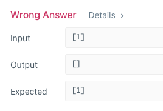

# 极客大学「算法训练营」第一周学习笔记


## 一、数组、链表、跳表
## 二、栈、队列、优先队列、双端队列

## 三、作业
### 1.（26）删除排序数组中的重复项
#### Python实现：
```python
class Solution:
    def removeDuplicates(self, nums: List[int]) -> int:
        for i in range(len(nums), 1, -1):
            if (nums[i-1]) == (nums[i-2]):
                nums.pop(i-1)
            else:
                continue
        return len(nums)
```
``` for i in range(len(nums), 1, -1): ```

这里只需要倒叙遍历到index=1，如果index=0，只有一个数的情况就会把这个数也弹出去：如图：


#### C++实现：
```C++

```

### 2.旋转数组
三次翻转法：时间O(n)，空间O(1)
```python
class Solution(object):
    def rotate(self, nums, k):
        print("k: ",k)
        if k is None or k <= 0:
            return
        k, end = k % len(nums), len(nums) - 1
        print(k," ", end)
        self.reverse(nums, 0, end - k)
        self.reverse(nums, end - k + 1, end)
        self.reverse(nums, 0, end)
        
    def reverse(self, nums, start, end):
        while start < end:
            # Python的变量并不直接存储值，而只是引用一个内存地址，交换变量时，只是交换了引用的地址。
            # 因此这里的空间复杂度就是O(1)
            nums[start], nums[end] = nums[end], nums[start]
            start, end = start + 1, end - 1
```
```
input: [1,2,3,4,5,6,7,8,9] k=2
```

第一次调转`self.reverse(nums, 0, end - k):`
```
[7,6,5,4,3,2,1,8,9]
``` 
第二次调转`self.reverse(nums, end - k + 1, end):`
```
[7,6,5,4,3,2,1,9,8]
``` 
第三次调转`self.reverse(nums, 0, end):`
```
[8,9,1,2,3,4,5,6,7]
``` 
### 3.合并两个有序链表
### 4.合并两个有序数组
### 5.两数之和
### 6.移动零
### 7.加一
### 8.设计循环双端队列
### 9.接雨水

## 四、预习题目
### 1.有效的字母异位词
### 2.二叉树的中序遍历
### 3.最小的k个数
